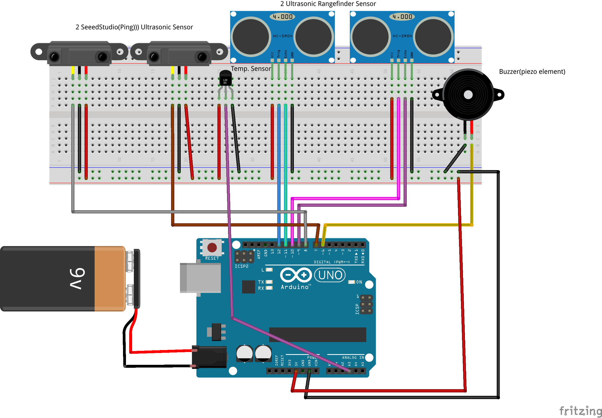

Visually-Impaired-Assistant
==================

##Project Overview##
The objective for our project is to help prevent visual impairs from crashing into obstacles. The plan that we originally have is to divide our project into two parts. First part is to do human detection using [thermal imaging sensor](http://www.rhworkshop.com/pages/product-ir-blue-dm) and the second part is to detect obstacle and staircases using ultrasonic range sensors with [Arduino Uno Borad](http://www.arduino.cc/en/Main/arduinoBoardUno).

After coming up with our project objective we are planning to remove the part with thermal imaging sensor to detect human since it does not relate to our project objective. Therefore, our project will be focusing on the portion to help detect obstacle and staircases for the visual impair. It plays a sound when obstacles, staircases and human is detected. In our current design for that hat for visual impairs to wear, we are planning to use 3 ultrasonic sensors. 1 will be pointing directly to the front to detect obstacles at the height of the person and 2 ultrasonic sensors pointing diagonally downward at a fix degree (different degree for each sensor). For the portion to detect staircases, we will set a fix value for the height and length of the staircase steps so once the sensor detects both of this height and length we will have the android application to prompt the user that there is staircase ahead. However, the problem that we may have in our design is that if the obstacles are too small, it might not be able to detect it. Also, if somebody jumps in front of the person, the sensor might have delay before it detects that there is an obstacle. This design is only for up staircases detection.

##Included Folders and Repo Contents##
###/Doc###
<ul>
		<li>"pre-requisite.doc" - What software and hardware you need to acquire before you start this project</li>
		<li>"software_install.doc" - step-by-step guide, with image and/or video if necessary, software installation and the pre-requisite such as library, drivers, platform etc.
		</li>
		<li>"hardware_install.doc" - step-by-step guide, with image and/or vidoe if necessary, hardware acquisition (from where and how much does it cost) driver download, installation and assembly details. This includes senors, chassis/platform, RF module, Aurdino etc.</li>
		<li>"assembly_guide.doc" - zero or more of assembly guide to put together the hardware/software.</li>
		<li>"references" - list of any papers/reports/articles that you used for the project.</li>
		<li>"honor statement" - stating the deliverable is your original work, and if you adopted anything from anyone, credit and make proper citation</li>
		<li>"team contribution statement" - detailing what each team member has done for the project, and the contribution of each member in the project. This statement should be signed by every team member.</li>
		</ul>
###/Software###
	containing individual subfolders for the app you download and used, software you developed (including source code, library, executable etc.)
###/Hardware###
	contain the interface software, drivers needed for your hardware
###Report on problems found and solved###

###Reflection###

##CircuitBoard##

##Video##
*[Assembly Video](https://www.youtube.com/watch?v=WbqXZgBYLgY)
 
*[Demo video](https://www.youtube.com/watch?v=l3yPzs39GY0)

##Contributors##
Meiling Lin, Haiqiang Zou
